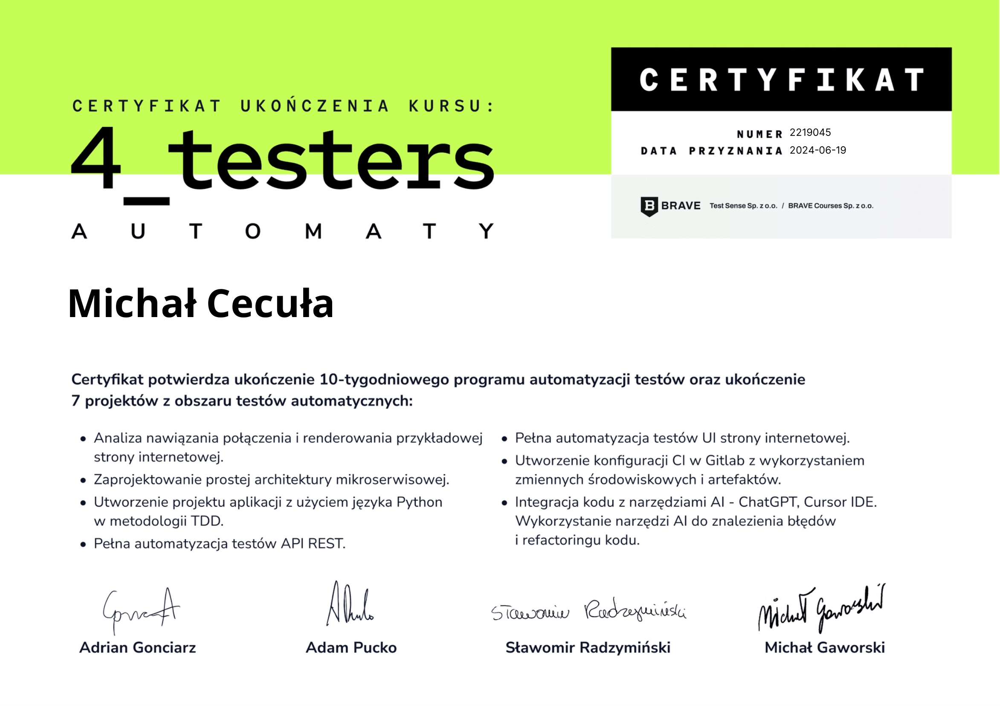

## 📗 Portfolio - Table of contents

* [Projects](#-projects---my-documentation-examples)
* [Technical skills](#-technology-and-technical-skills)
* [Courses](#%EF%B8%8F-courses)
* [Certificates](#-certificates)
* [Business Tools](#%EF%B8%8F-my-daily-business-tools)
* [Recommended Blogs and Newsletters](#-recommended-blogs-and-newsletters)
* [Technical books](#-technical-books)

### 📑 Projects - my documentation examples
#### PROJECT ["SKLEPTEST"](https://skleptest.pl)

- [x] Test plan
  - [Test Plan_Skleptest](https://1drv.ms/b/s!AmJMYH0iAf18hXcATDt9FQYFmzxR?e=qUs0ji)
- [x] Test cases and scenarios
  - [Test cases&scenarios_Skleptest](https://1drv.ms/x/s!AmJMYH0iAf18hWM6QLactLqGdY8R?e=Du7VA0)
- [x] Bug reports
  - [Bug reports_Skleptest](https://1drv.ms/x/s!AmJMYH0iAf18hXlaJg92jL8EqVZV?e=5PAfi2)
- [x] Final report
  - [Final summary report_Skleptest](https://1drv.ms/b/s!AmJMYH0iAf18hXhIOFZr8IO2raCS?e=Jxsswc)
  
#### PROJECT ["ALLEGRO SANDBOX"](https://allegro.pl.allegrosandbox.pl)

- [x] Test cases and scenarios
  - [Test cases&scenarios_Allegro_Sandbox](https://1drv.ms/x/s!AmJMYH0iAf18hWlPDkkFBiK4aXnI?e=CKOGCT)
- [x] Bug reports
  - [Bug reports_Allegro_Sandbox](https://1drv.ms/x/s!AmJMYH0iAf18hWjYXJaif-Oi0-Rk?e=BxAXfi)

### 👨‍💻 Technology and technical skills

- [x] PYTHON - basic knowledge
- [x] Automation tests UI - Selenium (webdriver)
- [x] REST API testing - Python (pytest, assertpy)
- [x] SQL
- [x] CI/CD - Docker, Github Actions
- [x] HTML5/CSS3
- [x] GIT
- [x] Awareness of SCRUM Methodology
- [x] ISTQB FL knowledge
- [x] Manual software testing
- [x] DevTools
- [x] English - B2
- [ ]  - in process of learning*

### 🛠️ Daily Business Tools
#### Main tester tools:
- [x] Jira, Confluence
- [x] Postman
- [x] Pycharm
- [x] MySQL
- [x] DevTools
- [x] Testlink
- [x] AI Tools: ChatGPT, Perplexity, Copilot
#### Usefull extensions:
- [x] Browserstack
- [x] Beard Eats Bug
- [x] Lightshot, Awesome Screenshot
- [x] Bug Magnet, Fake Filler
- [x] ClearCache, EditThisCookie
- [x] Wappalyzer
- [x] Color Zilla, WhatFont
- [x] Page Ruler
- [x] Mailtrap, 10minutemail
- [x] JSON Viewer

### 🖋️ Courses

- [x] 4_testers | 4testers.pl - [4_testers AUTOMATY](https://www.4testers.pl/)
- [x] Adam Gola | szkoleniedlaqa.pl - [Szkolenie dla QA](https://szkoleniedlaqa.pl/szkolenie/)
- [x] Sii Training Practice - [Zostań testerem](https://sii.pl/szkolenia/oferta/zostan-testerem/)
- [x] CodeGym - [Kurs Harvard CS50: "Podstawy programowania"](https://www.youtube.com/watch?v=WOvhPzWRUAY&list=PLrMB7p7ri2mZrwILyBTNAs1YaDyieN8PR&ab_channel=CodeGym)
- [x] Kamil Brzeziński - [GIT od podstaw](https://www.programujodpodstaw.pl/kursy/git-od-podstaw/)
- [x] Kamil Brzeziński - [Rekrutacja programisty](https://www.programujodpodstaw.pl/kursy/rekrutacja-programisty/)

##### UDEMY Courses
- Udemy - [Testowanie oprogramowania w praktyce | Bootcamp](https://www.udemy.com/course/testowanie-oprogramowania-w-praktyce-bootcamp/)
- Udemy - [Kurs SQL od podstaw | MySQL](https://www.udemy.com/course/kurs-sql-od-podstaw/)
- Udemy - [Postman od podstaw - testowanie REST API](https://www.udemy.com/course/postman-od-podstaw-testowanie-rest-api/)
- Udemy - [GIT od podstaw dla każdego](https://www.udemy.com/course/git-od-podstaw-dla-kazdego/)
- Udemy - [Kurs Jira od podstaw - zarządzanie projektami](https://www.udemy.com/course/kurs-jira-od-podstaw-zarzadzanie-projektami/)
- Udemy - [Podstawy Scrum i Agile - Teoria, Praktyka, Certyfikacja](https://www.udemy.com/course/scrum-podstawy-teoretyczne-praktyczne-certyfikacja/)

### 🥇 Certificates

| 4_testers   |
| --- |
|  |

| ISTQB   |  Szkolenie dla QA |
| --- | --- |
|  |  |

| DEVTOOLS | Sii - Training Practice |
| --- | --- |
|  |  |

### 💭 Recommended Blogs and Newsletters

##### Blogs
- [4_testers](https://www.4testers.pl/)
- [wyszkolewas.com.pl](https://www.wyszkolewas.com.pl/)
- [Fabryka Testów](https://fabrykatestow.pl/ciekawostki/)
- [jaktestowac.pl](https://jaktestowac.pl/)
##### Newsletters
- [Newsletter QA Weekly](https://szkoleniedlaqa.pl/newsletter/)
- [Newsletter Akademia QA - Testowa Sroda](https://subscribepage.com/l4q9k4)
- [Newsletter Ministry of Testing](https://www.ministryoftesting.com)
- [Newsletter 4_testers TEAM](https://www.4testers.pl/)

### 📚 Technical books

1. Certyfikowany tester ISTQB. Poziom podstawowy - Adam Roman, Lucjan Stapp
2. Zawód Tester - Radosław Smilgin
3. Testowanie Oprogramowania - Piotr Wicherski
4. Testowanie oprogramowania w praktyce - Adam Roman, Karolina Zmitrowicz
5. Pięć dysfunkcji pracy zespołowej - Patrick Lencioni
